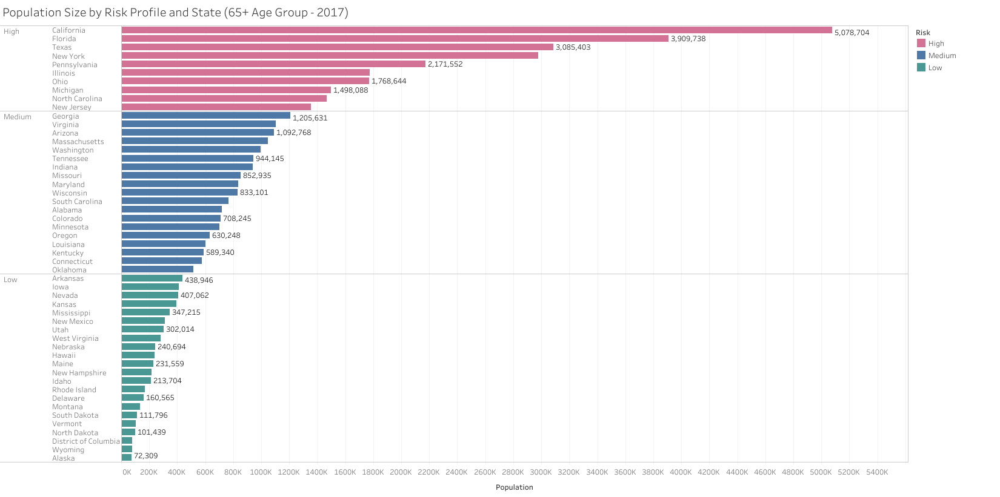

# Key Insights

## Vulnerable Populations - Who?
Adults aged 65 and older exhibit the widest variation and account for the vast majority of all influenza-related deaths.

|||
|:---:|:---:|
| *Adults aged 65 and older account for more than 60% of all influenza-related deaths — a trend that reinforces CDC classifications of this group as high risk.* | *The 65+ age group shows a significantly wider spread and the highest median number of deaths, reflecting both elevated mortality and greater variation compared to younger age groups.* |

## Seasonality – When?
Although the annual severity of influenza varied considerably, peak mortality consistently occurred in January, with Southern states often reporting the highest totals — though vulnerable states were not limited to that region.

|||
|:---:|:---:|
| *Influenza deaths rise in November, peak sharply in January, and decline through April. The South shows a notably higher average peak compared to other regions.* | *Influenza-related deaths vary from year to year, with notable surges in 2013 and 2015. The average annual death count across the period is 73,158 confirming that while flu season is consistent in timing each year, its severity can fluctuate.* |

## Risk Classification & Forecasting – Where & How Many?
States were classified into high, medium, and low risk based on their elderly populations, guiding an effective resource allocation framework.

||||
|:---:|:---:|:---:|
| *The colour of each state reflects the size of its 65+ population, while circle size represents influenza-related deaths in that group. This geospatial view confirms that high-risk populations are not confined to the South — with large vulnerable populations in California, the Northeast, and parts of the Midwest.* | *Shows the 65+ population across U.S. states grouped into High, Medium, and Low risk profiles.* | *Forecasted deaths for 2018 reveal sharp seasonal peaks in high-risk states, confirming the elevated burden in these areas. Low-risk states show minimal fluctuation, indicating a reduced need for additional staff.* |

<table>
<tr>
<td align="center" width="33%">
   
  <em>*The colour of each state reflects the size of its 65+ population, while circle size represents influenza-related deaths in that group. This geospatial view confirms that high-risk populations are not confined to the South — with large vulnerable populations in California, the Northeast, and parts of the Midwest.*</em>
</td>
<td align="center" width="33%">
   
  <em>*Shows the 65+ population across U.S. states grouped into High, Medium, and Low risk profiles.                                                                                                                                                                                                                            *</em>
</td>
<td align="center" width="33%">
   
  <em>*Forecasted deaths for 2018 reveal sharp seasonal peaks in high-risk states, confirming the elevated burden in these areas. Low-risk states show minimal fluctuation, indicating a reduced need for additional staff.                                                                                                     *</em>
</td>
</tr>
</table>